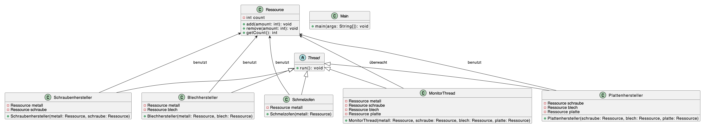

---
tags:
  - publish
---
### Aufgabenstellung
Es soll eine Produktion nachgestellt werden, in der die folgenden Teile in der angegebenen Zeit produziert werden: 
	1) Ein Schmelzofen produziert jede Sekunde eine Einheit Metall. •
	2) Alle sechs Sekunden soll eine Schraube aus einer Einheit Metall hergestellt werden. 
	3) Alle drei Sekunden wird ein Blech hergestellt, wofür fünf Einheiten Metall verbraucht werden. 
	4) Die Herstellung einer Platte dauert neun Sekunden und verbraucht ieweils zwei Schrauben und ein Blech. 
	5) In regelmäßigen Abständen soll auf der Konsole der Bestand der einzelnen Teile ausgegeben werden. 
	6) Überlegen Sie sich eine sinnvolle Klassenhierarchie. 

### Lösung
Um diese Produktion mit Threads zu simulieren, könnten Sie folgende Klassenhierarchie erstellen:

1. **Ressourcen-Klassen** - Diese repräsentieren die verschiedenen Ressourcen: Metall, Schraube, Blech und Platte.
2. **Produzenten-Klassen** - Diese repräsentieren die verschiedenen Produzenten: Schmelzofen, Schraubenhersteller, Blechhersteller und Plattenhersteller.

Test3





Hier ist ein einfacher Entwurf:

```java
class Ressource {
    private int count = 0;
    
    public synchronized void add(int amount) {
        count += amount;
        notifyAll();
    }
    
    public synchronized void remove(int amount) {
        while (count < amount) {
            try {
                wait();
            } catch (InterruptedException e) {
                Thread.currentThread().interrupt();
            }
        }
        count -= amount;
    }
    
    public synchronized int getCount() {
        return count;
    }
}

class Schmelzofen extends Thread {
    private final Ressource metall;

    public Schmelzofen(Ressource metall) {
        this.metall = metall;
    }

    @Override
    public void run() {
        while (!Thread.interrupted()) {
            try {
                Thread.sleep(1000);
                metall.add(1);
            } catch (InterruptedException e) {
                Thread.currentThread().interrupt();
            }
        }
    }
}

class Schraubenhersteller extends Thread {
    private final Ressource metall;
    private final Ressource schraube;

    public Schraubenhersteller(Ressource metall, Ressource schraube) {
        this.metall = metall;
        this.schraube = schraube;
    }

    @Override
    public void run() {
        while (!Thread.interrupted()) {
            try {
                Thread.sleep(6000);
                metall.remove(1);
                schraube.add(1);
            } catch (InterruptedException e) {
                Thread.currentThread().interrupt();
            }
        }
    }
}

class Blechhersteller extends Thread {
    private final Ressource metall;
    private final Ressource blech;

    public Blechhersteller(Ressource metall, Ressource blech) {
        this.metall = metall;
        this.blech = blech;
    }

    @Override
    public void run() {
        while (!Thread.interrupted()) {
            try {
                Thread.sleep(3000); // Alle drei Sekunden
                metall.remove(5);  // Verbraucht fünf Einheiten Metall
                blech.add(1);      // Produziert ein Blech
            } catch (InterruptedException e) {
                Thread.currentThread().interrupt();
            }
        }
    }
}

class Plattenhersteller extends Thread {
    private final Ressource schraube;
    private final Ressource blech;
    private final Ressource platte;

    public Plattenhersteller(Ressource schraube, Ressource blech, Ressource platte) {
        this.schraube = schraube;
        this.blech = blech;
        this.platte = platte;
    }

    @Override
    public void run() {
        while (!Thread.interrupted()) {
            try {
                Thread.sleep(9000);  // Alle neun Sekunden
                schraube.remove(2); // Verbraucht zwei Schrauben
                blech.remove(1);    // Verbraucht ein Blech
                platte.add(1);      // Produziert eine Platte
            } catch (InterruptedException e) {
                Thread.currentThread().interrupt();
            }
        }
    }
}


class MonitorThread extends Thread {
    private final Ressource metall;
    private final Ressource schraube;
    private final Ressource blech;
    private final Ressource platte;

    public MonitorThread(Ressource metall, Ressource schraube, Ressource blech, Ressource platte) {
        this.metall = metall;
        this.schraube = schraube;
        this.blech = blech;
        this.platte = platte;
    }

    @Override
    public void run() {
        while (!Thread.interrupted()) {
            System.out.println("Metall: " + metall.getCount());
            System.out.println("Schraube: " + schraube.getCount());
            System.out.println("Blech: " + blech.getCount());
            System.out.println("Platte: " + platte.getCount());
            System.out.println("-------------------");
            try {
                Thread.sleep(5000);  // beispielsweise alle 5 Sekunden
            } catch (InterruptedException e) {
                Thread.currentThread().interrupt();
            }
        }
    }
}

public class Main {
    public static void main(String[] args) {
        Ressource metall = new Ressource();
        Ressource schraube = new Ressource();
        Ressource blech = new Ressource();
        Ressource platte = new Ressource();

        new Schmelzofen(metall).start();
        new Schraubenhersteller(metall, schraube).start();
        new Blechhersteller(metall, blech).start();
        new Plattenhersteller(schraube, blech, platte).start();
        new MonitorThread(metall, schraube, blech, platte).start();
    }
}

```

Die Produzenten verwenden `Ressource::remove()` um Ressourcen zu verbrauchen und `Ressource::add()` um Ressourcen zu produzieren. Der `MonitorThread` gibt regelmäßig den aktuellen Bestand jeder Ressource aus.

Dieser Entwurf berücksichtigt nicht, dass möglicherweise Ressourcen nicht verfügbar sind oder dass der Produktionsschritt blockiert wird. Sie könnten jedoch mit Bedingungen und Synchronisation weiter daran arbeiten, um diese Anforderungen zu erfüllen.


#### **Allgemeine Übersicht und Zusammenfassung:**

Das Programm stellt eine Produktionskette dar, bei der aus Metall verschiedene Produkte wie Schrauben, Bleche und Platten hergestellt werden. Es werden mehrere Threads verwendet, um die simultane Produktion und den Verbrauch von Ressourcen zu simulieren.

**Klassen:**

- **Lager**: Diese Klasse repräsentiert ein Lager für eine Ressource wie Metall, Schrauben oder Bleche. Sie hat Methoden zum Hinzufügen und Entfernen von Ressourcen. Wenn nicht genügend Ressourcen zum Entfernen vorhanden sind, wird der Thread in den Wartezustand versetzt. Sobald Ressourcen hinzugefügt werden, werden alle wartenden Threads benachrichtigt.

- **Produzenten**: Für jeden Produktionsschritt gibt es einen eigenen Thread:
  - `Schmelzofen`: Produziert jede Sekunde eine Einheit Metall.
  - `SchraubenHersteller`: Verbraucht alle sechs Sekunden eine Einheit Metall, um eine Schraube herzustellen.
  - `BlechHersteller`: Verbraucht alle drei Sekunden fünf Einheiten Metall, um ein Blech zu produzieren.
  - `PlattenHersteller`: Verbraucht alle neun Sekunden zwei Schrauben und ein Blech, um eine Platte herzustellen.

**Funktionsweise:**

Jeder Produzenten-Thread arbeitet in einer unendlichen Schleife (`while(true)`). Innerhalb dieser Schleife:
- Wartet der Thread für eine bestimmte Zeit (z.B. 6 Sekunden für den `SchraubenHersteller`).
- Versucht, die benötigten Ressourcen aus dem entsprechenden Lager zu entnehmen.
- Fügt das produzierte Produkt dem entsprechenden Lager hinzu.

Während ein Thread wartet, kann er durch externe Faktoren (wie z.B. einen anderen Thread) unterbrochen werden. Dies würde eine `InterruptedException` auslösen. In unserem Kontext wird diese Ausnahme insbesondere dann ausgelöst, wenn ein Thread auf Ressourcen wartet (`wait()`) und nicht genügend Ressourcen im Lager vorhanden sind.

Wenn der Thread unterbrochen wird, während er auf Ressourcen wartet, wird der `catch`-Block in der `run()`-Methode des Threads ausgeführt. Der Aufruf von `Thread.currentThread().interrupt()` im `catch`-Block setzt lediglich das Unterbrechungsstatus-Flag des Threads, hat in unserem aktuellen Kontext jedoch keine weiteren Auswirkungen, da es keine Überprüfung auf dieses Flag gibt.

Das bedeutet, dass selbst wenn ein Produzenten-Thread unterbrochen wird, während er auf Ressourcen wartet, er nicht aufhört zu arbeiten. Stattdessen wird er weiterhin versuchen, die benötigten Ressourcen aus dem Lager zu entnehmen und mit der Produktion fortzufahren.

#### Programmablauf:

1. **Start des Programms**: Am Anfang haben alle Lager den Bestand 0. Alle Hersteller-Threads werden gestartet und beginnen unabhängig voneinander mit ihrer Arbeit.

2. **Schmelzofen**: Der Schmelzofen-Thread fügt jede Sekunde eine Einheit Metall dem Metalllager hinzu. Er wird durch nichts blockiert und produziert kontinuierlich.

3. **SchraubenHersteller**: Alle sechs Sekunden versucht dieser Thread, eine Einheit Metall aus dem Lager zu entnehmen, um eine Schraube herzustellen. Wenn genügend Metall vorhanden ist (was am Anfang der Fall ist), wird die Schraube hergestellt und dem Schraubenlager hinzugefügt.

4. **BlechHersteller**: Alle drei Sekunden versucht dieser Thread, fünf Einheiten Metall aus dem Lager zu entnehmen. Falls nicht genug Metall vorhanden ist, geht dieser Thread in den Wartezustand, bis genug Metall vorhanden ist. Während der BlechHersteller wartet, läuft der Schmelzofen weiter und fügt dem Metalllager hinzu. Sobald genügend Metall vorhanden ist, wird der BlechHersteller automatisch fortgesetzt, nimmt die benötigten Metalleinheiten und fügt ein Blech hinzu.

5. **PlattenHersteller**: Alle neun Sekunden versucht dieser Thread, zwei Schrauben und ein Blech aus ihren jeweiligen Lagern zu entnehmen. Falls nicht genug Ressourcen vorhanden sind (z.B. nur eine Schraube oder kein Blech), geht der Thread in den Wartezustand. Während der PlattenHersteller wartet, laufen die anderen Threads weiter. Sobald die benötigten Ressourcen verfügbar sind, setzt der PlattenHersteller seine Arbeit fort.

**Beispiel-Szenario**:

Angenommen, der BlechHersteller wartet, weil es weniger als 5 Einheiten Metall im Lager gibt. Während er wartet:

- Der **Schmelzofen** fügt weiterhin Metall zum Lager hinzu.
  
- Der **SchraubenHersteller** könnte weiterhin Schrauben produzieren, da er nur eine Einheit Metall benötigt. Er könnte sogar mehrere Schrauben herstellen, während der BlechHersteller immer noch wartet.

Sobald das Metalllager 5 oder mehr Einheiten hat, fährt der BlechHersteller fort. Er entnimmt 5 Einheiten und produziert ein Blech. 

Das Warten eines Herstellers auf Ressourcen hat keinen direkten Einfluss auf die anderen Hersteller. Jeder Thread läuft unabhängig voneinander und wartet nur, wenn er selbst nicht genug Ressourcen zum Arbeiten hat. Einige Hersteller könnten also weiterarbeiten, während andere warten, was zu einer gewissen Unvorhersehbarkeit in der Reihenfolge der Produktion führt. Es hängt alles von der Verfügbarkeit der Ressourcen und dem Timing der verschiedenen Threads ab.